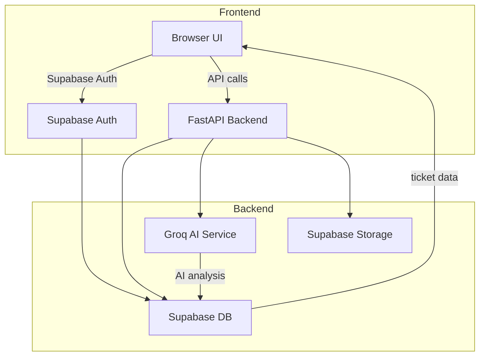
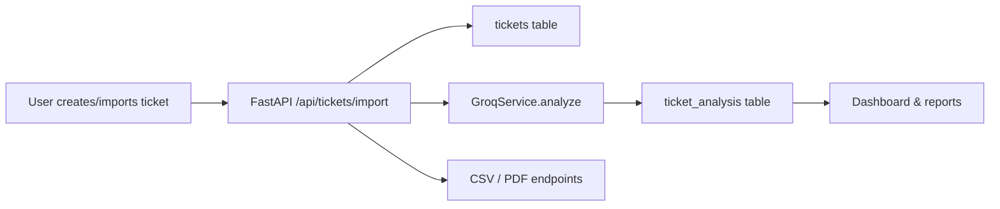
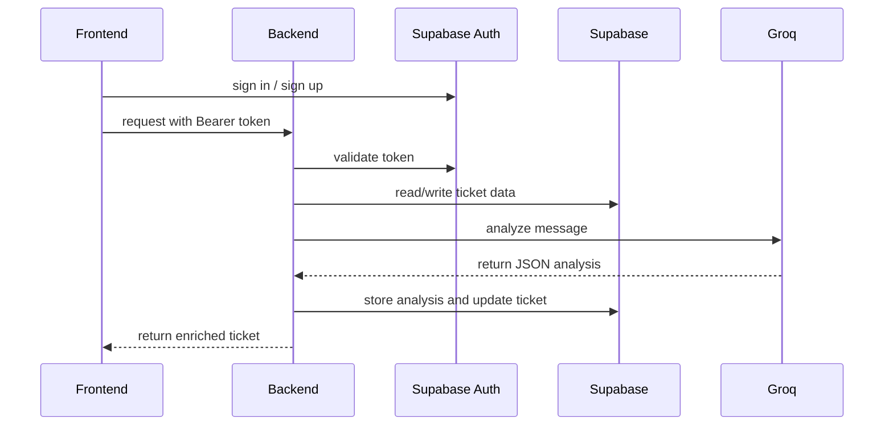

# Routr AI

Routr AI is a full-stack support triage SaaS platform built with:
- Frontend: React + Vite + TypeScript + Tailwind CSS
- Backend: FastAPI + Python + Supabase
- AI: Groq-powered ticket analysis and automated routing
- Database: Supabase PostgreSQL with Auth, RLS, storage, and custom SQL schema

The application helps support teams ingest tickets, analyze them with AI, route them to departments, monitor analytics, and export ticket reports.

---

## Table of Contents

- [Project Overview](#project-overview)
- [Architecture](#architecture)
- [Key Features](#key-features)
- [Repository Layout](#repository-layout)
- [Local Setup](#local-setup)
  - [Prerequisites](#prerequisites)
  - [Backend Setup](#backend-setup)
  - [Frontend Setup](#frontend-setup)
  - [Supabase Setup](#supabase-setup)
- [Environment Variables](#environment-variables)
- [API Routes](#api-routes)
- [Frontend Pages & Navigation](#frontend-pages--navigation)
- [AI Triage Flow](#ai-triage-flow)
- [Mermaid Architecture Diagrams](#mermaid-architecture-diagrams)
- [Deployment Notes](#deployment-notes)
- [Troubleshooting](#troubleshooting)
- [Future Improvements](#future-improvements)

---

## Project Overview

Routr AI is designed to be a modern support triage dashboard for customer success and operations teams. It enables:
- ticket ingestion via manual entry, import, or simulation
- AI-powered ticket classification and sentiment analysis
- department routing based on rules and AI recommendations
- analytics and insights for workload, priority, and sentiment
- exports for CSV and PDF reports

The backend relies on Supabase for auth, data storage, row-level security, and service-account access. The frontend is built as a single-page application with protected routes, keyboard shortcuts, a command palette, and reactive dashboards.

---

## Architecture

### Backend
- `backend/app/main.py` initializes FastAPI, CORS, and API routers.
- `backend/app/core/config.py` loads runtime config from `.env` via `pydantic-settings`.
- `backend/app/database/supabase_client.py` provides a Supabase admin client using the service role key.
- `backend/app/middleware/auth.py` validates Supabase JWT tokens for protected API calls.
- `backend/app/routers/` contains routers for AI analysis, ticket import, simulator generation, analytics overview, and report export.
- `backend/app/services/` contains reusable business logic for ticket creation, AI analysis, analytics, simulation, and routing.
- `backend/app/ai/prompts.py` stores the AI system prompt used by the Groq model.

### Frontend
- `frontend/src/main.tsx` initializes React, router, and TanStack Query.
- `frontend/src/App.tsx` defines public and authenticated routes.
- `frontend/src/lib/supabase.ts` configures the Supabase client.
- `frontend/src/lib/api.ts` provides helper functions for authenticated backend requests.
- `frontend/src/pages/` contains UI pages for dashboard, inbox, routing, analytics, simulator, import, and settings.
- `frontend/src/components/` contains shared UI components and layout elements.
- `frontend/src/hooks/` contains auth, keyboard shortcuts, theme support, and UI state hooks.

---

## Key Features

- Supabase authentication with login, signup, and password recovery
- AI ticket analysis via Groq and JSON extraction of classification
- Ticket import endpoint with background AI processing
- Simulator endpoint for bulk generation of demo tickets
- Export endpoints for CSV exports and PDF ticket reports
- Analytics overview with breakdowns for categories, priority, sentiment, departments, and trends
- Route management for department assignment and rule-based routing
- Command palette and keyboard shortcuts for productivity
- Dark mode and theme preference support

---

## Repository Layout

```
Routr AI/
├── backend/
│   ├── app/
│   │   ├── ai/
│   │   │   └── prompts.py
│   │   ├── core/
│   │   │   └── config.py
│   │   ├── database/
│   │   │   └── supabase_client.py
│   │   ├── middleware/
│   │   │   └── auth.py
│   │   ├── routers/
│   │   │   ├── ai.py
│   │   │   ├── analytics.py
│   │   │   ├── export.py
│   │   │   ├── simulator.py
│   │   │   └── tickets.py
│   │   ├── schemas/
│   │   │   └── models.py
│   │   └── services/
│   │       ├── activity_service.py
│   │       ├── analytics_service.py
│   │       ├── groq_service.py
│   │       ├── routing_service.py
│   │       ├── simulator_service.py
│   │       └── ticket_service.py
│   └── requirements.txt
├── frontend/
│   ├── src/
│   │   ├── App.tsx
│   │   ├── main.tsx
│   │   ├── lib/
│   │   │   ├── api.ts
│   │   │   └── supabase.ts
│   │   ├── pages/
│   │   └── components/
│   ├── package.json
│   └── tsconfig.json
└── supabase/
    └── schema.sql
```

---

## Local Setup

### Prerequisites

- Node.js 20+ (or latest stable LTS)
- npm 10+ or pnpm
- Python 3.12+ or latest compatible version
- Supabase project with Auth enabled
- Groq API key for AI analysis

### Backend Setup

1. Create a Python virtual environment.

```bash
cd backend
python -m venv .venv
.venv\Scripts\activate
```

2. Install backend dependencies.

```bash
pip install -r requirements.txt
```

3. Create the backend environment file.

```bash
copy .env.example .env
```

4. Fill `.env` with your Supabase and Groq credentials.

Example `.env`:

```bash
SUPABASE_URL=https://your-project.supabase.co
SUPABASE_ANON_KEY=your-public-anon-key
SUPABASE_SERVICE_ROLE_KEY=your-service-role-key
GROQ_API_KEY=your-groq-api-key
GROQ_MODEL=llama-3.3-70b-versatile
CORS_ORIGINS=http://localhost:5173
```

5. Start the backend.

```bash
uvicorn app.main:app --reload --host 0.0.0.0 --port 8000
```

### Frontend Setup

1. Install frontend dependencies.

```bash
cd frontend
npm install
```

2. Create the frontend environment file.

```bash
copy .env.example .env
```

3. Configure `frontend/.env`.

```bash
VITE_SUPABASE_URL=https://your-project.supabase.co
VITE_SUPABASE_ANON_KEY=your-public-anon-key
VITE_API_URL=http://localhost:8000
```

4. Start the frontend.

```bash
npm run dev
```

### Supabase Setup

1. Open your Supabase project.
2. Go to the SQL editor.
3. Run `supabase/schema.sql`.
4. Confirm tables, row-level security policies, and storage bucket `avatars` exist.

This schema includes:
- `profiles`
- `departments`
- `tickets`
- `ticket_analysis`
- `routing_rules`
- `activities`
- `ticket_notes`
- `settings`
- storage bucket policies for avatar uploads

---

## Environment Variables

### Backend (`backend/.env`)

- `SUPABASE_URL`: Supabase project URL
- `SUPABASE_ANON_KEY`: Supabase anon public key
- `SUPABASE_SERVICE_ROLE_KEY`: Supabase service role key for admin operations
- `GROQ_API_KEY`: Groq API key for ticket analysis
- `GROQ_MODEL`: Default Groq model name
- `CORS_ORIGINS`: Allowed CORS origins for frontend access

### Frontend (`frontend/.env`)

- `VITE_SUPABASE_URL`: Same Supabase URL
- `VITE_SUPABASE_ANON_KEY`: Same Supabase anon key
- `VITE_API_URL`: Backend URL, typically `http://localhost:8000`

---

## API Routes

### Authentication
- Frontend uses Supabase Auth client for sign-up, sign-in, and session handling.
- Backend protects routes using Bearer token authentication via `app.middleware.auth.get_current_user`.

### Backend routes

Base path: `/api`

- `POST /api/ai/analyze` - analyze arbitrary text using Groq and return AI analysis
- `POST /api/ai/analyze-ticket/{ticket_id}` - analyze a specified ticket and persist results
- `POST /api/tickets/import` - import ticket batch and queue background analysis
- `POST /api/simulator/generate` - generate demo tickets for the current user
- `GET /api/analytics/overview` - retrieve dashboard analytics and trends
- `GET /api/export/tickets/csv` - download current user tickets as CSV
- `GET /api/export/ticket/{ticket_id}/pdf` - download a PDF report for the requested ticket

### Data flow
- Protected routes require `Authorization: Bearer <access_token>`
- The backend uses Supabase service role for read/write operations to user tables
- AI analysis is saved to `ticket_analysis` and ticket metadata is updated accordingly

---

## Frontend Pages & Navigation

The SPA includes these primary pages:

- `Dashboard` — overview metrics, ticket trends, and performance cards
- `Inbox` — list of tickets and detail view via `/inbox/:id`
- `Playground` — manual AI text analyzer for custom messages
- `Simulator` — generate demo tickets and auto-analyze them
- `Import` — upload/import ticket batches
- `Routing` — configure routing rules and department mapping
- `Analytics` — charts and breakdowns for sentiment, category, priority, and departments
- `Settings` — user preferences, AI key config, and theme controls

User routing is defined in `frontend/src/App.tsx` and protected by the `useAuth()` hook.

---

## AI Triage Flow

1. A ticket is created manually, imported, or generated via the simulator.
2. The backend calls `GroqService.analyze()` using the prompt in `backend/app/ai/prompts.py`.
3. Groq returns structured JSON containing category, priority, department, sentiment, confidence, summary, reasoning, suggested reply, suggested action, and estimated resolution.
4. `TicketService.analyze_and_save()` stores the analysis in `ticket_analysis` and updates the ticket.
5. Routing rules are applied to resolve a department assignment.
6. The UI displays tickets with AI metadata, analytics, and routing suggestions.

The system prompt is intentionally strict so the LLM returns valid JSON only.

---

## Mermaid Architecture Diagrams

### System Architecture



### Ticket Lifecycle



### Request flow



---

## Deployment Notes

- Frontend can be deployed to Vercel, Netlify, or any static host.
- Backend can be deployed to a cloud VM, Heroku-style host, or Azure App Service.
- Ensure environment variables are configured for production.
- Use secure storage of Supabase service role keys and Groq API keys.
- Set `CORS_ORIGINS` to your deployed frontend domain.

### Production checklist

- Enable HTTPS for both frontend and backend
- Use strong Supabase security policies
- Rotate Supabase service role and anon keys if leaked
- Monitor Groq usage and model costs
- Add request validation or rate limiting if needed

---

## Troubleshooting

### Backend fails to start
- Verify `backend/.env` exists and contains valid keys
- Confirm `python` points to the expected Python version
- Run `pip install -r backend/requirements.txt`
- Check `uvicorn` output for missing imports or invalid env values

### Supabase auth returns 401
- Ensure `VITE_SUPABASE_URL` and `VITE_SUPABASE_ANON_KEY` match your Supabase project
- Confirm the frontend sends `Authorization: Bearer <access_token>`
- Check `backend/app/middleware/auth.py` for token validation issues

### AI analysis errors
- Confirm `GROQ_API_KEY` is set in backend `.env`
- Verify `backend/app/ai/prompts.py` prompt is valid JSON-friendly text
- Check the Groq model name in `GROQ_MODEL`

---

## Future Improvements

- Add ticket comments and threaded conversation support
- Enable rule editor UI for routing rules in the dashboard
- Add multi-tenant support and organization-level teams
- Support file attachments and richer ticket metadata
- Add live notifications for new priorities and escalations

---

## Notes

This README describes the current codebase state and should be updated whenever new backend routes, frontend pages, or Supabase schema changes are introduced.
